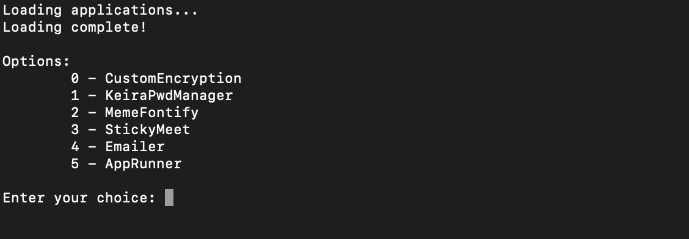

# Python Applications Manager (AM)

## What is AM?
AM is basically a tool to easily manage and run all of your Python projects so you don't have to keep running your Python Project folders at different locations everytime, which is very tedious.

AM hopes to remove the tediousness by having an easy-to-use interface and such that you can get to your more important stuff easier.



## How do I install AM?
For installing and using AM, simply follow the steps provided below.

---
#### Requirements for installing AM:
###### Python 3.9 or higher. Install the latest version of Python [here](https://python.org)
---

1) Install the latest version of AM [here](https://github.com/Prakhar896/AM/releases)
2) Extract the contents of the downloaded `AM-1.0` file.
3) AM comes in-built with some basic python projects as well as a project called [StickyMeet](https://github.com/Prakhar896/StickyMeet). A full list of in-built projects can be found in `in-built_projects.md`

### Usage of AM with IDLE
4) Open up IDLE
5) Open up the `main.py` file in `AM-1.0`. Click Run > Run Module to run AM.

### Usage of AM with Terminal/Command Prompt
4) Open up Terminal (macOS)/ Command Prompt (Windows)
5) cd (change directory) into your AM folder. If the Downloads location for your browser is default, it should be `cd Downloads/AM`
6) Run `python main.py` to run AM.

## How do I add my own Python Project folders to AM?
There are a couple of ways to easily add your own project folder to AM. You can either just drop your folder under the AM folder or import directly from AM using an `import` command.

###### Before adding your own folder, please read requirements.md to find out what you need to do so that your project can be properly loaded and launched by AM.

### Adding using Drag & Drop
Simply drag and drop your project folder under the AM folder such that the `main.py` file of AM is at the same level as your project.

An example file structure:
From:
```
Desktop
    |-->new folder
 ```
 
 To:
```
AM
  |-->new folder
  |-->main.py
```

### Adding using `import` command
1) Launch up AM
2) When AM prompts you to `Enter a choice: `, type in `import <path to the new folder>`. For e.g (on macOS computer): `import /Users/myuser/Desktop/new folder`

